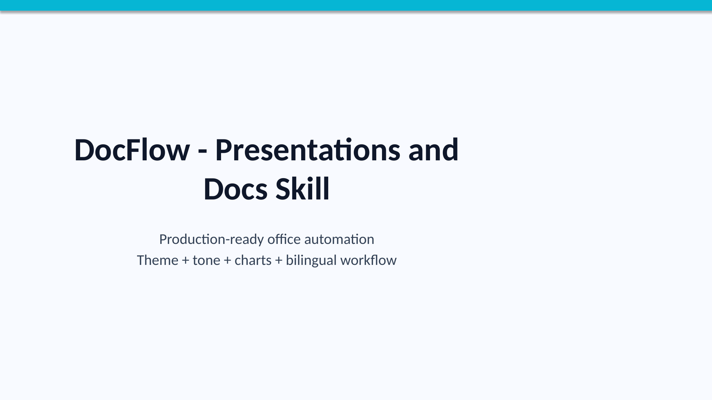
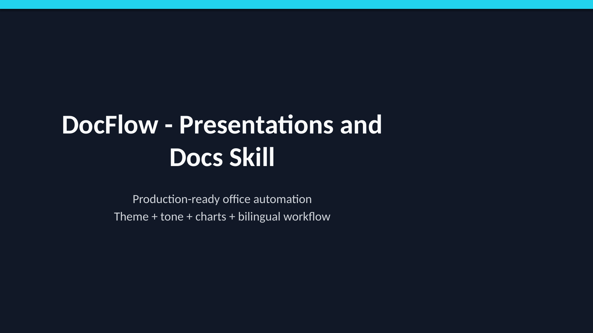
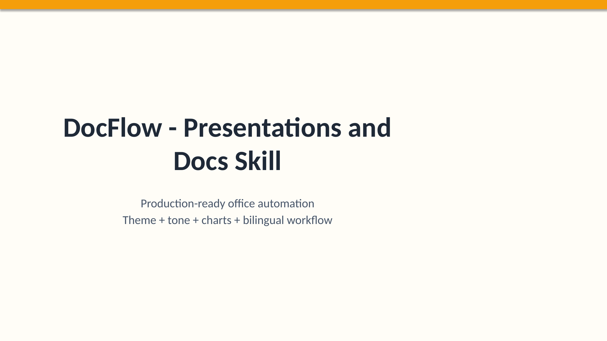
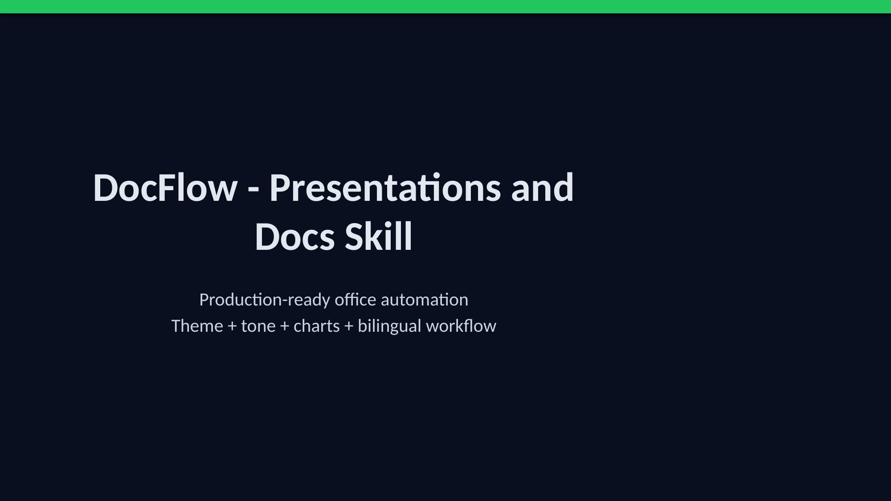
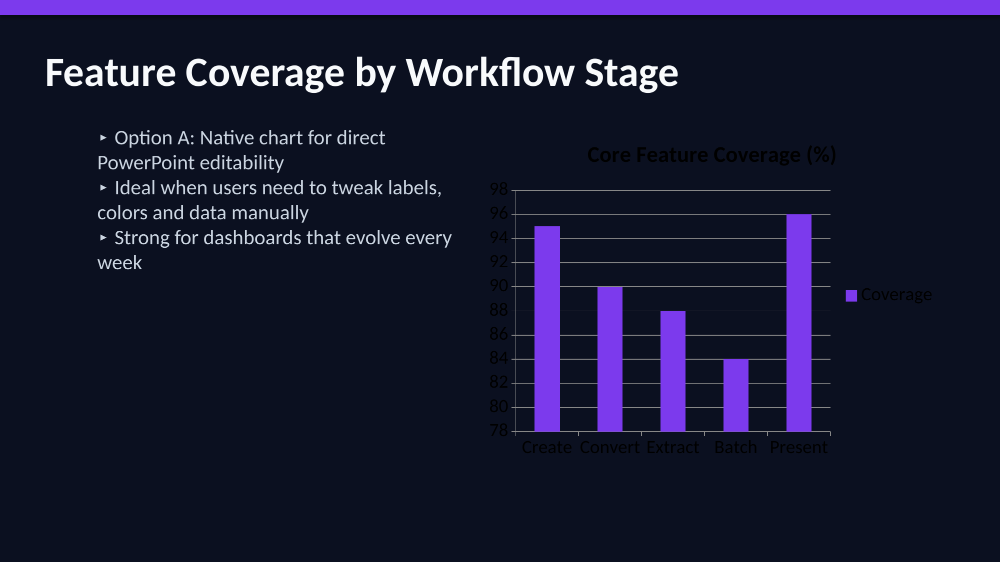
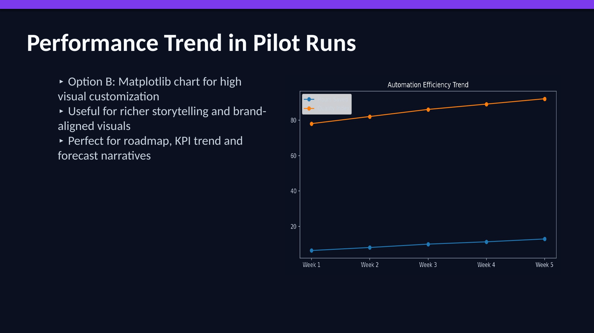
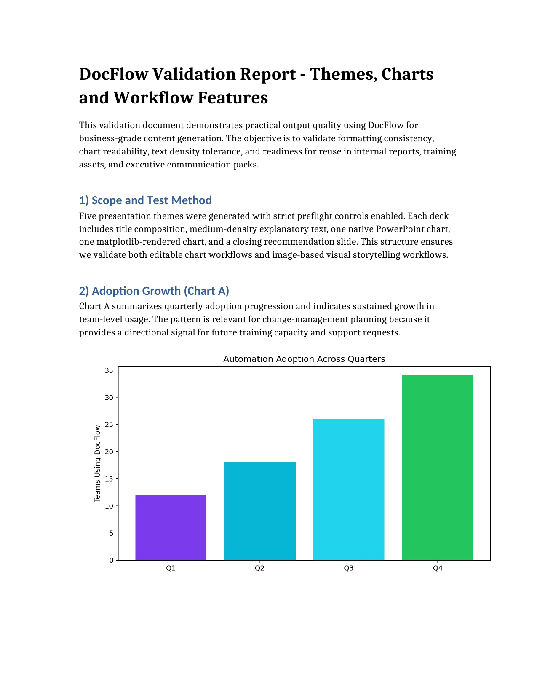

<div align="center">

# DocFlow - Presentations and Docs Skill

[](./LICENSE)
[](https://www.python.org/downloads/)
[](#hermes--openclaw-auto-install)
[](./docs/SECURITY.md)

**An open, local-first office automation skill for documents and presentations.**

<a href="#english">English</a> |
<a href="#español">Español</a>

</div>

## 🎉 News

- **2026-04-17**
  - Final product identity locked to **DocFlow - Presentations and Docs Skill**.
  - Repo normalized to be **agent-agnostic** (Hermes/OpenClaw + Python API).
  - README redesigned in modern style (hero, badges, clean navigation, quickstart flow).
  - Added attribution clarity (`LICENSE`, `NOTICE`, credits in README).
  - Added presentation preflight + dual chart mode documentation.
  - Release prepared as **V1.0**.

## Hermes / OpenClaw Auto Install

Use this block directly in Hermes/OpenClaw tasks to install and run DocFlow:

```bash
git clone https://github.com/rafalozan0/DocFlow-Presentations-and-Docs-Skill.git
cd DocFlow-Presentations-and-Docs-Skill
python -m compileall src examples setup.py
python -m pip install -r requirements.txt || true
```

If the environment has no `pip`, run in isolated mode:

```bash
uv run --with python-pptx --with python-docx --with openpyxl --with reportlab --with pypdf2 --with pandas --with pillow --with numpy --with matplotlib python examples/basic_usage.py
```

### What it is for

DocFlow helps agents generate real deliverables, fast:
- Word reports (`.docx`)
- Excel sheets (`.xlsx`)
- PDF files (`.pdf`)
- PowerPoint decks (`.pptx`)

### How to use

1) Install with the block above.
2) Load `SKILL.md` in your agent runtime.
3) Use the Python API `OfficeSuite` for create/convert/extract workflows.
4) For presentations, enforce preflight: `theme`, `chart_mode`, `use_emojis`, `tone`.

## Screenshots

### Theme previews







### Slide examples





### Document example



## English

### Why DocFlow?

DocFlow is built for practical work, not theory slides. It helps AI agents and Python workflows produce office outputs fast, safely, and consistently.

- **Agent-agnostic by design**: works with Hermes, OpenClaw, or any Python-capable runtime.
- **Local-first by default**: no hidden uploads or silent third-party calls.
- **Production-ready outputs**: DOCX, XLSX, PDF, PPTX creation and processing.
- **Presentation-first controls**: style preflight + dual chart engine.

### Features

- Unified Python API: `OfficeSuite`
- Create files: `.docx`, `.xlsx`, `.pdf`, `.pptx`
- Convert formats (LibreOffice-backed)
- Extract text/data from Office files
- Batch conversion + watermark helpers
- Explicit SMTP email sending with attachments
- Presentation preflight preferences:
  - `theme`
  - `chart_mode`
  - `use_emojis`
  - `tone`
- Dual chart modes for decks:
  - Option A: native `python-pptx`
  - Option B: `matplotlib` chart images

## Installation

### Quick Install (recommended for isolated environments)

```bash
uv run --with python-pptx --with python-docx --with openpyxl --with reportlab --with pypdf2 --with pandas --with pillow --with numpy --with matplotlib python examples/basic_usage.py
```

### Standard Install

```bash
python -m pip install -r requirements.txt
python -m compileall src examples setup.py
python examples/basic_usage.py
```

### Optional system dependency (for advanced conversion)

- LibreOffice (`soffice`) for robust format conversions.
- See full install notes: `docs/INSTALL.md`

## Quick Start

```python
from office_suite import OfficeSuite

suite = OfficeSuite()

result = suite.create(
    "word",
    title="Daily Report",
    content="# Summary\nAll tasks completed.",
    output_path="./output/daily_report.docx",
)

print(result)
```

### PPTX Preflight (strict mode)

```python
from office_suite import OfficeSuite

suite = OfficeSuite()
print(suite.get_presentation_preflight_prompts())
```

Required keys when `require_preflight=True`:
- `theme`: `midnight-luxe | aurora-glow | obsidian-slate | ivory-bloom | neon-velocity`
- `chart_mode`: `native | matplotlib | auto`
- `use_emojis`: `true | false`
- `tone`: `classic-formal | boardroom | conversational | laid-back`

## Agent Usage

Use directly from Python:

```python
from office_suite import OfficeSuite
suite = OfficeSuite()
```

Or orchestrate via skill metadata:
- `SKILL.md` (root)
- `docs/AGENT_COMPATIBILITY.md`

Prompt template for agent runners:

```text
Use the local skill "DocFlow - Presentations and Docs Skill".
Load SKILL.md first, then use OfficeSuite API for document and presentation tasks.
Enforce preflight for PPTX jobs (theme/chart_mode/use_emojis/tone).
Keep processing local-first and only use SMTP when explicitly requested.
```

## Security

- Local-first processing by default.
- No hidden outbound calls.
- Network usage only for explicit SMTP send operations.
- Never hardcode secrets; use `OFFICE_EMAIL_PASSWORD`.

Details:
- `docs/SECURITY.md`

## Known limitations

- PDF watermark currently performs a safe pass-through copy + warning.
- PPT transition effects are placeholders due to `python-pptx` limitations.

## Credits and Attribution

- Original project and base implementation: **Tao Jin** (`shynloc`)
- Adaptation, hardening, bilingual normalization, and agent-agnostic restructuring: **Rafael Lozano**
- License remains **MIT**. See `LICENSE` and `NOTICE`.

## Español

### ¿Qué es DocFlow?

DocFlow es una skill local-first para automatizar documentos y presentaciones con agentes y Python.

- Agnóstico a agentes (Hermes/OpenClaw/otros)
- Enfoque práctico para generar entregables reales
- Seguridad por defecto (sin llamadas ocultas)
- API simple para integrar rápido

### Instalación rápida

```bash
python -m pip install -r requirements.txt
python -m compileall src examples setup.py
python examples/basic_usage.py
```

O con runtime efímero (`uv`):

```bash
uv run --with python-pptx --with python-docx --with openpyxl --with reportlab --with pypdf2 --with pandas --with pillow --with numpy --with matplotlib python examples/basic_usage.py
```

### Uso básico

```python
from office_suite import OfficeSuite
suite = OfficeSuite()

suite.create(
    "pptx",
    title="Demo",
    slides=[{"layout": "title", "title": "DocFlow", "content": "Skill lista para producción"}],
    output_path="./output/demo.pptx",
)
```

### Créditos y licencia

- Proyecto original: **Tao Jin** (`shynloc`)
- Modificaciones/adaptación: **Rafael Lozano**
- Licencia: **MIT** (`LICENSE` + `NOTICE`)

## Repository structure

```text
.
├── SKILL.md
├── NOTICE
├── README.md
├── LICENSE
├── docs/
│   ├── INSTALL.md
│   ├── SECURITY.md
│   ├── AGENT_COMPATIBILITY.md
│   └── screenshots/
├── examples/
│   ├── basic_usage.py
│   ├── batch_process.py
│   ├── presentation_style_chart_demo.py
│   └── workflow_example.yaml
├── src/office_suite/
│   ├── __init__.py
│   ├── core.py
│   ├── docx.py
│   ├── xlsx.py
│   ├── pdf.py
│   ├── pptx.py
│   ├── email.py
│   └── utils.py
├── setup.py
└── requirements.txt
```

## License

This project is licensed under the MIT License.
See [LICENSE](./LICENSE) for details.
